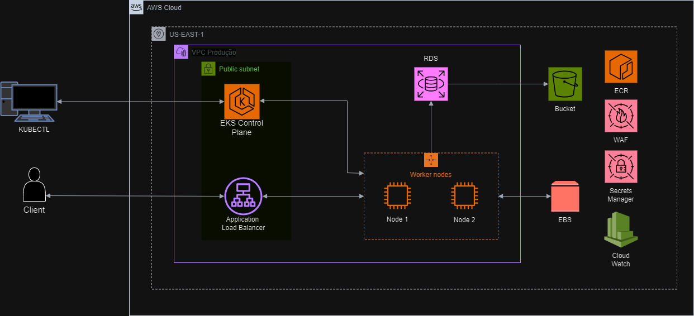

# Projeto EKS - Kaua Sleep

## Contexto

A **Kaua Sleep** está em expansão e busca melhorar seus processos de desenvolvimento através de uma aplicação web robusta utilizando **Kubernetes** no **Amazon EKS**. O objetivo é implementar uma infraestrutura escalável, automatizada e segura.

## Estrutura do Projeto

1. **Cluster Kubernetes**
   - **Amazon EKS**: Gerencia contêineres com alta escalabilidade e resiliência, aproveitando a integração com outros serviços AWS.
   
2. **Repositório de Imagens Docker**
   - **Amazon ECR**: Centraliza o armazenamento de imagens Docker para deploy contínuo no Kubernetes.

3. **Armazenamento Persistente**
   - **Amazon EBS**: Proverá volumes persistentes para os pods, garantindo a integridade dos dados.

4. **Monitoramento e Segurança**
   - **Amazon CloudWatch**: Coleta métricas e logs dos recursos, configurando alertas proativos.
   - **AWS WAF**: Protege a aplicação web contra ameaças externas.

## Estrutura de Módulos no Terraform

O projeto adota uma abordagem modular para facilitar a reutilização e organização dos recursos. Principais módulos:

- **VPC Module**: Provisão da rede privada (VPC), subnets e gateways para isolar os recursos.
- **EKS Module**: Configura o cluster EKS com nós gerenciados, grupos de segurança e permissões associadas.
- **ECR Module**: Cria o repositório de imagens Docker e gerencia o ciclo de vida das imagens.
- **CloudWatch Module**: Configura o monitoramento com alarmes e dashboards personalizados.

Cada módulo é responsável por um conjunto específico de recursos, promovendo a reutilização e facilidade na manutenção da infraestrutura.

## Kubernetes no Projeto

- **Deployment e Service**: Configura o **Deployment** para gerenciar réplicas da aplicação e o **Service** para expor a aplicação dentro e fora do cluster.
- **Persistent Volume (PV) e Persistent Volume Claim (PVC)**: Garante que o armazenamento seja persistente entre reinicializações dos pods, ligando os volumes do **Amazon EBS** aos pods do Kubernetes.